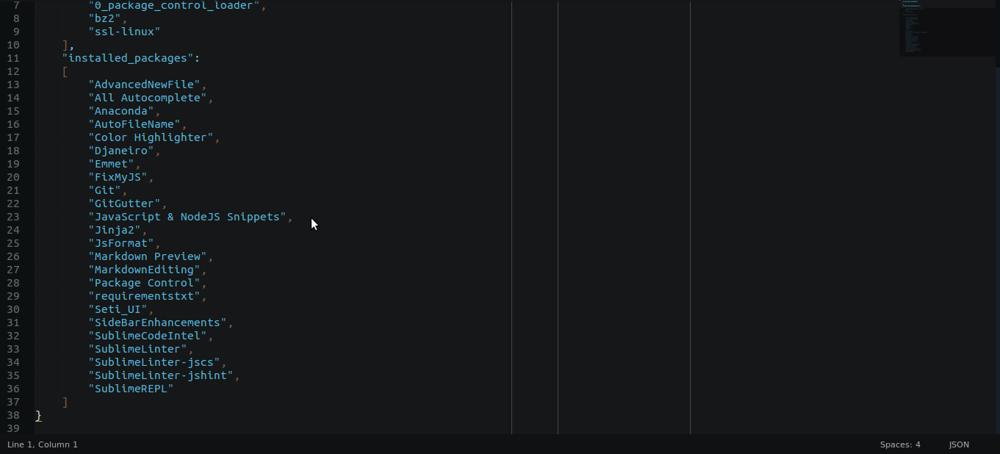

My Enviroment
==========

Personal configuration for Sublime Text 3 and python environment at Ubuntu. It's focused on webdeveloper.

My goal in this project is to be a model, if you don't like something, fork and customize!

Features:
- git
- web2py support
- django support
- pep8
- pyflake
- html helpers(emmet)
- virtual environment(virtualenvwrapper)
- better console(ipython)
- markdown preview
- ...and more!

I have a custom bash [here](https://github.com/cassiobotaro/dot_files)

####Requirements:

- Ubuntu

- Python

####Instalation
    
    ./utils.sh
    ./install-enviroment.sh
    ./install-sublime.sh
    ./install-plugins.sh
    ./install-preferences.sh

Change the theme to SetiUI 
 `Preferences > Color Scheme > Seti_UI > Scheme > Seti`

####Description

See what each script do:

    * utils.sh - Install nodejs(required for some plugins), git(version control) and pip(python package manager)

    * install-enviroment.sh - Install a python enviroment with pip, ipython, virtualenvwrapper and pytest

    * install-sublime.sh - Install sublime text with package control
    
    * install-plugins.sh - Install plugins in sublime
    
    * install-preferences.sh - Some personal configurations

####Commands

    - Ctrl + P            ->  Goto anything
    - Ctrl + f            ->  search in file
    - Ctrl + r            ->  goto symbol in file
    - Ctrl + g            ->  goto line in file
    - alt + /             ->  autcomplete
    - ctrl + /            ->  toggle comment
    - ctrl + l            ->  select line
    - ctrl + ]            ->  indent
    - ctrl + ]            ->  unindent
    - ctrl + shift + v    ->  paste and indent
    - ctrl + shift + k    ->  delete line
    - ctrl + shift + d    ->  duplicate line
    - ctrl + shift + up   ->  up line
    - ctrl + shift + down ->  down line
    - ctrl + shift + f    ->  search in project
    where: <project>

#####Anaconda:

    - shift + alt + g     ->  go to definition
    - shift + alt + f     ->  find usages
    - shift + alt + d     ->  show docstring
    - shift + alt + r     ->  auto format with pep8

#####Others

    - ctrl + alt + f      ->  format js

####Optional branches

Tsting branches

[Ubuntu 15.04](https://github.com/cassiobotaro/my_environment/tree/ubuntu1504)
[Ubuntu 14.04](https://github.com/cassiobotaro/my_environment/tree/ubuntu1404)
